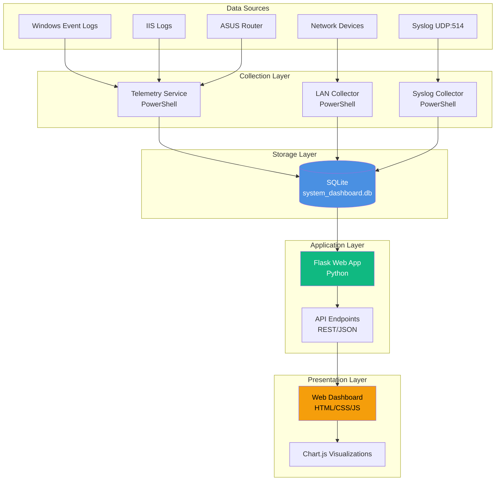
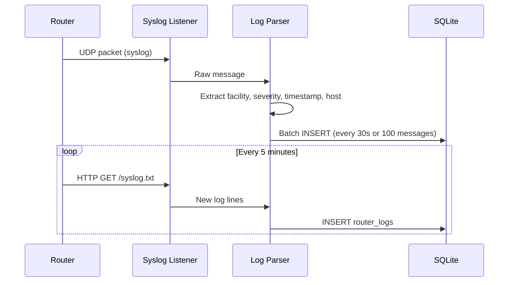
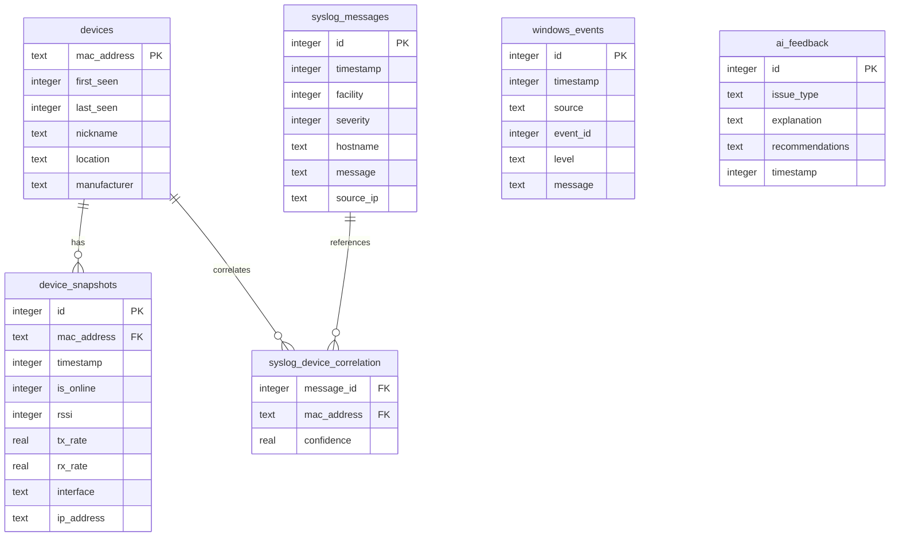
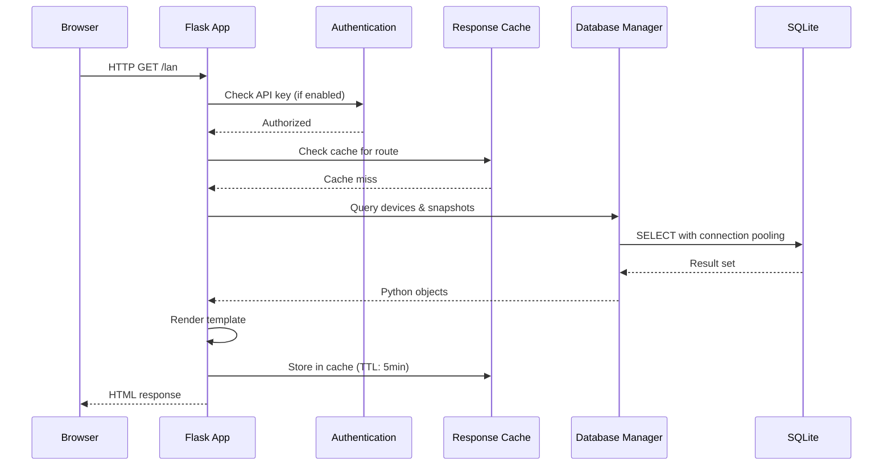
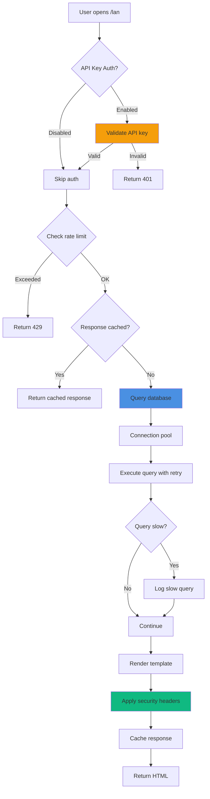
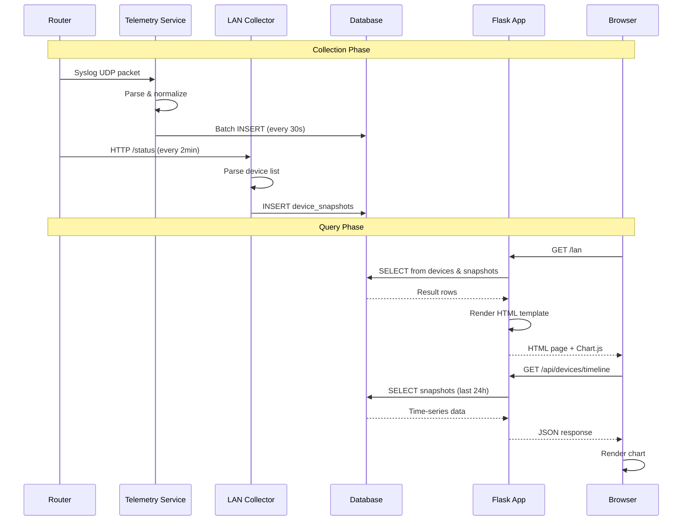
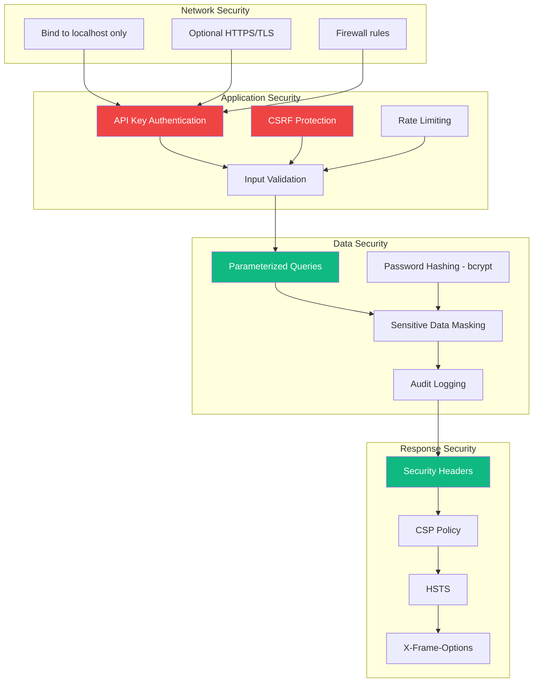
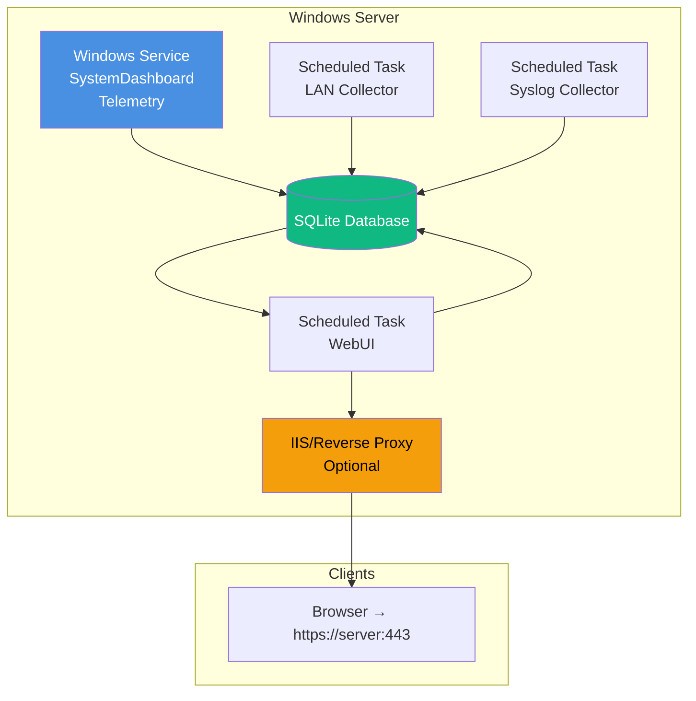
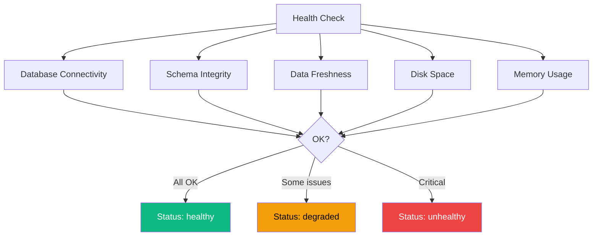

# SystemDashboard - Architecture Documentation

## Overview

SystemDashboard is a Windows-first operations telemetry stack designed with a "PowerShell-first" orchestration layer and "SQLite first-class" storage strategy. This document describes the system architecture, component interactions, and design decisions.

## High-Level Architecture



## Component Architecture

### 1. Collection Layer

#### Telemetry Service (`services/SystemDashboardService.ps1`)

**Purpose**: Long-running PowerShell service that collects logs from multiple sources.

**Responsibilities**:
- Bind UDP socket on port 514 for syslog messages
- Poll ASUS router for log exports
- Normalize and enrich log data
- Batch insert into SQLite database
- Maintain persistent state for polling

**Implementation Details**:
```powershell
# Service runs as Windows Service (SYSTEM account)
# Logs to: var/log/telemetry-service.log
# State file: var/asus/state.json
# Config: config.json
```

**Data Flow**:


#### LAN Collector Service (`services/LanCollectorService.ps1`)

**Purpose**: Dedicated service for network device monitoring.

**Responsibilities**:
- Poll router API for connected devices
- Track device presence (online/offline)
- Record signal strength (RSSI), transfer rates
- Detect interface type (wired/wireless, band)
- Store time-series snapshots

**Collection Frequency**: Every 2 minutes (configurable)

**Data Model**:
```sql
-- Devices (persistent)
CREATE TABLE devices (
    mac_address TEXT PRIMARY KEY,
    first_seen INTEGER NOT NULL,
    last_seen INTEGER NOT NULL,
    nickname TEXT,
    location TEXT
);

-- Snapshots (time-series)
CREATE TABLE device_snapshots (
    id INTEGER PRIMARY KEY,
    mac_address TEXT NOT NULL,
    timestamp INTEGER NOT NULL,
    is_online INTEGER NOT NULL,
    rssi INTEGER,
    tx_rate REAL,
    rx_rate REAL,
    interface TEXT,
    FOREIGN KEY (mac_address) REFERENCES devices(mac_address)
);
```

#### Syslog Collector Service (`services/SyslogCollectorService.ps1`)

**Purpose**: Lightweight UDP listener for router/network device syslog.

**Responsibilities**:
- Bind to UDP port 514 (configurable)
- Parse RFC 3164 syslog format
- Extract facility, severity, host, message
- Insert into syslog tables

**Protocol Support**:
- RFC 3164 (BSD syslog)
- Partial RFC 5424 (structured syslog)

### 2. Storage Layer

#### SQLite Database (`var/system_dashboard.db`)

**Design Decisions**:

1. **Why SQLite?**
   - Single-file simplicity (no server required)
   - Excellent performance for read-heavy workloads
   - ACID compliance with transactions
   - Built-in to Python (no dependencies)
   - Perfect for Windows single-machine deployment

2. **Performance Optimizations**:
   - WAL mode enabled (concurrent readers/writer)
   - Connection pooling (max 5 connections)
   - Query timeouts (10 seconds)
   - Strategic indexes on hot columns
   - Materialized views for complex aggregations

3. **Schema Organization**:



**Key Tables**:

| Table | Purpose | Retention |
|-------|---------|-----------|
| `devices` | Device inventory (persistent) | Forever |
| `device_snapshots` | Time-series metrics | 90 days |
| `syslog_messages` | Router/network logs | 90 days |
| `windows_events` | Windows Event Log entries | Manual cleanup |
| `ai_feedback` | AI-generated insights | Forever |
| `alerts` | System alerts | 30 days after resolution |

**Indexes** (Phase 1 optimization):
```sql
CREATE INDEX idx_snapshots_timestamp ON device_snapshots(timestamp);
CREATE INDEX idx_snapshots_mac ON device_snapshots(mac_address);
CREATE INDEX idx_syslog_timestamp ON syslog_messages(timestamp);
CREATE INDEX idx_syslog_severity ON syslog_messages(severity);
CREATE INDEX idx_events_timestamp ON windows_events(timestamp);
```

### 3. Application Layer

#### Flask Web Application (`app/app.py`)

**Framework**: Flask 2.3+ (Python)

**Architecture Pattern**: Model-View-Controller (MVC)

**Request Flow**:


**Key Modules**:

| Module | Purpose | Phase |
|--------|---------|-------|
| `app/app.py` | Main Flask application | Initial |
| `app/db_manager.py` | Database connection pooling | Phase 1 |
| `app/validators.py` | Input validation | Phase 1 |
| `app/api_utils.py` | API helpers (error responses, caching) | Phase 1 |
| `app/health_check.py` | Health monitoring | Phase 1 |
| `app/rate_limiter.py` | Rate limiting | Phase 1 |
| `app/graceful_shutdown.py` | Signal handling | Phase 1 |
| `app/security_headers.py` | Security headers (CSP, HSTS) | Phase 3 |
| `app/auth.py` | API key authentication | Phase 3 |
| `app/csrf_protection.py` | CSRF tokens | Phase 3 |
| `app/audit_trail.py` | Audit logging | Phase 3 |
| `app/performance_monitor.py` | Query performance tracking | Phase 4 |
| `app/pagination.py` | Keyset/offset pagination | Phase 4 |
| `app/data_retention.py` | Automated cleanup | Phase 4 |

**API Endpoints**:

```mermaid
graph LR
    A[API Root] --> B[/api/devices]
    A --> C[/api/events]
    A --> D[/api/router]
    A --> E[/api/health]
    A --> F[/api/performance]
    
    B --> B1[GET /api/devices - List devices]
    B --> B2[GET /api/devices/:mac - Device details]
    B --> B3[PUT /api/devices/:mac - Update device]
    
    C --> C1[GET /api/events - Query events]
    C --> C2[GET /api/events/:id - Event details]
    
    D --> D1[GET /api/router/logs - Router logs]
    D --> D2[GET /api/router/stats - Statistics]
    
    E --> E1[GET /health - Simple health]
    E --> E2[GET /health/detailed - Full health report]
    
    F --> F1[GET /api/performance/queries - Query stats]
    F --> F2[GET /api/performance/resources - Resource usage]
    F --> F3[POST /api/performance/query-plan - Analyze query]
```

### 4. Presentation Layer

#### Frontend Architecture

**Technology Stack**:
- Vanilla JavaScript (no frameworks)
- Chart.js 4.4.0 for visualizations
- CSS Grid and Flexbox for layouts
- CSS variables for theming

**Component Structure**:
```
wwwroot/
├── index.html              # Dashboard home
├── events.html             # Event log viewer
├── router.html             # Router log viewer
├── lan.html                # LAN device tracking
├── css/
│   └── styles.css          # Global styles + CSS variables
└── js/
    ├── dashboard-utils.js  # Shared utilities
    ├── form-utils.js       # Form validation/autosave
    ├── table-utils.js      # Table sorting/export
    ├── keyboard-nav.js     # Keyboard shortcuts
    └── performance-utils.js # Lazy loading/debounce

app/templates/              # Flask templates
├── base.html              # Base layout
├── index.html             # Home dashboard
├── events.html            # Events page
├── router_logs.html       # Router logs
├── lan.html               # LAN observability
└── health.html            # Health check page
```

**Design System**:
```css
:root {
  /* Colors */
  --primary-color: #2563eb;
  --success-color: #10b981;
  --warning-color: #f59e0b;
  --danger-color: #ef4444;
  --info-color: #06b6d4;
  
  /* Spacing */
  --spacing-xs: 0.25rem;
  --spacing-sm: 0.5rem;
  --spacing-md: 1rem;
  --spacing-lg: 1.5rem;
  --spacing-xl: 2rem;
  
  /* Typography */
  --font-family: -apple-system, BlinkMacSystemFont, 'Segoe UI', sans-serif;
  --font-size-sm: 0.875rem;
  --font-size-base: 1rem;
  --font-size-lg: 1.125rem;
  
  /* Borders */
  --border-radius: 0.375rem;
  --border-color: #e5e7eb;
}
```

**State Management**:
- LocalStorage for user preferences (search filters, pagination)
- Session state for authentication tokens
- No client-side database (all data fetched via API)

**Performance Features** (Phase 4):
- Lazy loading of charts (IntersectionObserver)
- Debounced search inputs (300ms delay)
- Throttled scroll handlers (RAF)
- Response caching (5-minute TTL)

## Data Flow

### Complete Request Lifecycle



### Data Collection Flow



## Security Architecture

### Security Layers (Phase 3)



**Security Mechanisms**:

1. **Authentication**:
   - Optional API key (header: `X-API-Key`)
   - Bcrypt hashed keys (cost: 12)
   - Environment variable configuration

2. **CSRF Protection**:
   - Double-submit cookie pattern
   - Token validation on POST/PUT/DELETE
   - Automatic token generation

3. **Input Validation**:
   - MAC address format validation
   - IP address validation
   - Date range validation
   - SQL injection prevention (parameterized queries)
   - Path traversal prevention

4. **Security Headers**:
   ```python
   Content-Security-Policy: default-src 'self'; script-src 'self' cdn.jsdelivr.net
   Strict-Transport-Security: max-age=31536000; includeSubDomains
   X-Frame-Options: DENY
   X-Content-Type-Options: nosniff
   X-XSS-Protection: 1; mode=block
   ```

5. **Audit Trail**:
   - All configuration changes logged
   - Login attempts tracked
   - API access logged
   - Sensitive data masked (passwords, tokens)

## Performance Architecture

### Query Optimization (Phase 4)

**Connection Pooling**:
```python
class ConnectionPool:
    def __init__(self, db_path, max_connections=5):
        self.pool = Queue(maxsize=max_connections)
        # Pre-create connections
        for _ in range(max_connections):
            conn = sqlite3.connect(db_path)
            conn.execute("PRAGMA journal_mode=WAL")
            self.pool.put(conn)
```

**Query Performance Tracking**:
```python
@track_query_performance
def get_devices():
    # Automatically logs if query > 100ms
    return db.execute("SELECT * FROM devices")
```

**Pagination Strategies**:

1. **Offset Pagination** (traditional):
   ```sql
   SELECT * FROM devices
   ORDER BY last_seen DESC
   LIMIT 50 OFFSET 100;  -- O(n) performance
   ```

2. **Keyset Pagination** (efficient):
   ```sql
   SELECT * FROM devices
   WHERE last_seen < ?  -- cursor value
   ORDER BY last_seen DESC
   LIMIT 50;  -- O(1) performance
   ```

**Caching Strategy**:
```python
@cache_response(ttl=300)  # 5 minutes
def get_dashboard_summary():
    # Expensive aggregation query
    # Result cached for 5 minutes
    pass
```

### Frontend Performance (Phase 4)

**Lazy Loading**:
```javascript
// Charts load only when scrolled into view
const observer = new IntersectionObserver((entries) => {
    entries.forEach(entry => {
        if (entry.isIntersecting) {
            loadChart(entry.target);
        }
    });
});
```

**Debouncing**:
```javascript
// Search input debounced to reduce API calls
const debouncedSearch = debounce((query) => {
    fetchResults(query);
}, 300);  // 300ms delay
```

**Resource Monitoring**:
```python
# Track memory, CPU, disk usage
monitor = get_resource_monitor()
stats = monitor.get_stats()
# { 'memory_mb': 150, 'disk_usage_pct': 45 }
```

## Deployment Architecture

### Development Deployment

```
Developer Machine (Windows 11)
├── Git repository clone
├── Python virtual environment (.venv)
├── SQLite database (var/system_dashboard.db)
├── Services (manual start)
│   ├── Telemetry Service (PowerShell)
│   └── Flask App (python app/app.py)
└── Browser → http://localhost:5000
```

### Production Deployment



**Production Considerations**:

1. **Windows Service** for Telemetry (runs as SYSTEM)
2. **Scheduled Tasks** for WebUI and collectors (run on startup)
3. **HTTPS** via IIS or reverse proxy
4. **Firewall rules** for UDP 514 (syslog)
5. **API key authentication** enabled
6. **Data retention** scheduled (daily at 2 AM)
7. **Database VACUUM** scheduled (weekly during maintenance)

## Scalability Considerations

### Current Limits

| Resource | Limit | Bottleneck |
|----------|-------|------------|
| Concurrent users | ~20 | SQLite write lock |
| Database size | ~10 GB | Disk I/O |
| Collection rate | ~1000 msg/sec | PowerShell parsing |
| API requests | ~100 req/sec | Flask single-threaded |
| Device tracking | ~500 devices | Memory in LAN collector |

### Scaling Strategies

**Horizontal Scaling** (Not Currently Supported):
- Would require distributed database (PostgreSQL cluster)
- Load balancer for Flask instances
- Message queue for collection (RabbitMQ, Redis)

**Vertical Scaling** (Supported):
- Increase RAM for caching
- Faster SSD for database
- More CPU cores for PowerShell services
- Tune connection pool size

**Recommended for Large Deployments**:
1. Move to PostgreSQL for better concurrency
2. Use message queue for data collection
3. Deploy multiple Flask instances behind load balancer
4. Implement read replicas for queries

## Monitoring & Observability

### Health Check Endpoints

```python
GET /health              # Simple: {"status": "healthy"}
GET /health/detailed     # Comprehensive health report
```

**Health Check Components**:


### Performance Monitoring

**Query Performance**:
```python
GET /api/performance/queries
# Returns: {
#   "slow_queries": [...],
#   "stats": { "avg_ms": 45, "max_ms": 250 }
# }
```

**Resource Monitoring**:
```python
GET /api/performance/resources
# Returns: {
#   "memory": { "rss_mb": 150, "vms_mb": 200 },
#   "disk": { "database_size_mb": 450, "usage_pct": 45 }
# }
```

### Logging Architecture

**Log Levels**:
- **DEBUG**: Verbose diagnostics (dev only)
- **INFO**: Normal operations (startup, config)
- **WARNING**: Unexpected but handled (connection retry)
- **ERROR**: Failed operations (query timeout)
- **CRITICAL**: System-level failures (database corruption)

**Log Locations**:
```
var/log/
├── telemetry-service.log       # Telemetry collection
├── webui-service.log           # Flask application
├── lan-collector.log           # LAN device tracking
└── syslog-collector.log        # Syslog ingestion
```

**Structured Logging** (Phase 3):
```json
{
  "timestamp": "2025-12-10T09:00:00Z",
  "level": "ERROR",
  "message": "Database query timeout",
  "context": {
    "query": "SELECT * FROM devices",
    "duration_ms": 10500,
    "retry_attempt": 3
  }
}
```

## Technology Stack Summary

| Layer | Technology | Version | Purpose |
|-------|-----------|---------|---------|
| **OS** | Windows 11 | 23H2+ | Host platform |
| **Orchestration** | PowerShell | 7.3+ | Service management |
| **Backend** | Python | 3.10+ | Web application |
| **Framework** | Flask | 2.3+ | HTTP server |
| **Database** | SQLite | 3.40+ | Data storage |
| **Frontend** | HTML/CSS/JS | ES6+ | User interface |
| **Charts** | Chart.js | 4.4.0 | Visualizations |
| **Authentication** | Bcrypt | Latest | Password hashing |
| **Testing** | Pytest | 7.4+ | Python tests |
| **Testing** | Pester | 5.5+ | PowerShell tests |

## Design Principles

1. **PowerShell First**: Orchestration and Windows integration via PowerShell
2. **SQLite First-Class**: Single-file database for simplicity
3. **Graceful Degradation**: Continue operating when optional features unavailable
4. **Security by Default**: Security features enabled in production
5. **Observable**: Comprehensive logging and health checks
6. **Performant**: Optimized queries, caching, pagination
7. **Maintainable**: Modular code, clear separation of concerns
8. **Tested**: Unit tests for all critical paths
9. **Documented**: Inline docs, user guides, API reference

## Future Architecture Considerations

### Phase 6-7 Enhancements

1. **Email Notifications**: SMTP integration for alerts
2. **Webhook Support**: External system integration
3. **Multi-tenancy**: Support multiple isolated instances
4. **API Versioning**: `/api/v2/` for breaking changes
5. **WebSocket Support**: Real-time dashboard updates
6. **Background Jobs**: Celery for long-running tasks
7. **Distributed Tracing**: OpenTelemetry integration

### Migration Path to PostgreSQL

If outgrowing SQLite:

1. Add database abstraction layer (SQLAlchemy)
2. Create PostgreSQL migration scripts
3. Update connection pooling for Postgres
4. Migrate data with downtime or blue-green deployment
5. Update backup/restore procedures

### Microservices Consideration

For very large deployments, consider splitting:

- **Collection Service**: Standalone data ingestion
- **Query Service**: Read-only API
- **Write Service**: State-changing operations
- **Analytics Service**: Report generation

---

## Conclusion

SystemDashboard follows a pragmatic, Windows-first architecture optimized for single-machine deployments with local SQLite storage. The modular design allows for incremental enhancements while maintaining simplicity for typical use cases. All architectural decisions prioritize ease of installation, maintenance, and troubleshooting for IT professionals managing small to medium Windows environments.

For deployment guidance, see [DEPLOYMENT.md](DEPLOYMENT.md).  
For API details, see [API-REFERENCE.md](API-REFERENCE.md).  
For database schema, see [DATABASE-SCHEMA.md](DATABASE-SCHEMA.md).
