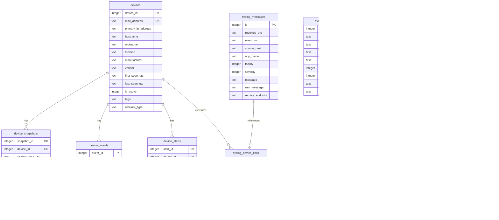

# SystemDashboard - Database Schema Documentation

This document describes the complete database schema for SystemDashboard, including tables, relationships, indexes, and data retention policies.

## Table of Contents

- [Overview](#overview)
- [Schema Design Principles](#schema-design-principles)
- [Entity Relationship Diagram](#entity-relationship-diagram)
- [Core Telemetry Tables](#core-telemetry-tables)
- [LAN Observability Tables](#lan-observability-tables)
- [AI Feedback Tables](#ai-feedback-tables)
- [Indexes and Performance](#indexes-and-performance)
- [Data Retention Policies](#data-retention-policies)
- [Migration History](#migration-history)
- [Query Examples](#query-examples)

## Overview

SystemDashboard uses **SQLite** as its database engine, providing a single-file database with ACID compliance and excellent performance for read-heavy workloads.

**Database File**: `var/system_dashboard.db`  
**SQLite Version**: 3.40+  
**Journal Mode**: WAL (Write-Ahead Logging)  
**Foreign Keys**: Enabled

## Schema Design Principles

1. **Timestamps in UTC**: All timestamps stored as ISO 8601 text (`YYYY-MM-DD HH:MM:SS`)
2. **Foreign Key Integrity**: Enforced relationships between tables
3. **Automatic Timestamps**: `created_at` and `updated_at` default to current time
4. **Cascade Deletes**: Device deletion removes related snapshots, events, alerts
5. **Strategic Indexes**: Optimized for time-range queries and filtering
6. **Text-Based IDs**: MAC addresses and identifiers use TEXT for flexibility

## Entity Relationship Diagram



## Core Telemetry Tables

### syslog_messages

Stores syslog messages received from routers, network devices, and Linux servers.

**Schema**:

| Column | Type | Constraints | Description |
|--------|------|-------------|-------------|
| `id` | INTEGER | PRIMARY KEY | Auto-incrementing message ID |
| `received_utc` | TEXT | NOT NULL | When message was received by collector |
| `event_utc` | TEXT | | When event occurred (from message timestamp) |
| `source_host` | TEXT | | Hostname/IP of sending device |
| `app_name` | TEXT | | Application that generated the message |
| `facility` | INTEGER | | Syslog facility code (0-23) |
| `severity` | INTEGER | | Syslog severity (0=emergency, 7=debug) |
| `message` | TEXT | | Parsed message content |
| `raw_message` | TEXT | | Original raw syslog message |
| `remote_endpoint` | TEXT | | IP:Port of sender |
| `source` | TEXT | NOT NULL, DEFAULT 'syslog' | Message source identifier |
| `created_at` | TEXT | NOT NULL, DEFAULT NOW | Record creation time |

**Indexes**:
- `idx_syslog_received_utc` on `received_utc DESC`
- `idx_syslog_source` on `source, received_utc DESC`
- `idx_syslog_severity` on `severity, received_utc DESC`

**Syslog Severity Levels**:

| Code | Severity | Description |
|------|----------|-------------|
| 0 | Emergency | System unusable |
| 1 | Alert | Immediate action required |
| 2 | Critical | Critical conditions |
| 3 | Error | Error conditions |
| 4 | Warning | Warning conditions |
| 5 | Notice | Normal but significant |
| 6 | Info | Informational messages |
| 7 | Debug | Debug-level messages |

**Syslog Facility Codes**:

| Code | Facility | Description |
|------|----------|-------------|
| 0 | kern | Kernel messages |
| 1 | user | User-level messages |
| 3 | daemon | System daemons |
| 4 | auth | Security/authorization |
| 16 | local0 | Local use 0 |
| 23 | local7 | Local use 7 |

**Example Query**:

```sql
-- Get error and critical messages from last hour
SELECT received_utc, source_host, message
FROM syslog_messages
WHERE severity <= 3
  AND received_utc >= datetime('now', '-1 hour')
ORDER BY received_utc DESC;
```

### eventlog_windows

Stores Windows Event Log entries collected from local or remote Windows systems.

**Schema**:

| Column | Type | Constraints | Description |
|--------|------|-------------|-------------|
| `id` | INTEGER | PRIMARY KEY | Auto-incrementing event ID |
| `received_utc` | TEXT | NOT NULL, DEFAULT NOW | When event was collected |
| `event_utc` | TEXT | | When event occurred |
| `source_host` | TEXT | | Computer name where event occurred |
| `provider_name` | TEXT | | Event provider (e.g., Microsoft-Windows-Security-Auditing) |
| `event_id` | INTEGER | | Windows Event ID |
| `level` | INTEGER | | Event level (1=Critical, 2=Error, 3=Warning, 4=Info) |
| `level_text` | TEXT | | Human-readable level |
| `task_category` | TEXT | | Event task category |
| `keywords` | TEXT | | Event keywords (comma-separated) |
| `message` | TEXT | | Event message body |
| `raw_xml` | TEXT | | Original XML event data |
| `source` | TEXT | NOT NULL, DEFAULT 'windows_eventlog' | Source identifier |
| `created_at` | TEXT | NOT NULL, DEFAULT NOW | Record creation time |

**Indexes**:
- `idx_eventlog_received_utc` on `received_utc DESC`
- `idx_eventlog_level` on `level, received_utc DESC`
- `idx_eventlog_provider` on `provider_name, received_utc DESC`

**Windows Event Levels**:

| Code | Level | Description |
|------|-------|-------------|
| 1 | Critical | Critical error |
| 2 | Error | Error |
| 3 | Warning | Warning |
| 4 | Information | Informational |
| 5 | Verbose | Verbose/Debug |

**Common Event IDs**:

| Event ID | Provider | Description |
|----------|----------|-------------|
| 4624 | Security | Successful login |
| 4625 | Security | Failed login |
| 4672 | Security | Special privileges assigned |
| 1000 | Application | Application error |
| 7036 | System | Service state change |

**Example Query**:

```sql
-- Get failed login attempts (Event ID 4625)
SELECT event_utc, source_host, message
FROM eventlog_windows
WHERE event_id = 4625
  AND received_utc >= datetime('now', '-24 hours')
ORDER BY event_utc DESC;
```

### iis_requests

Stores IIS (Internet Information Services) web server request logs.

**Schema**:

| Column | Type | Constraints | Description |
|--------|------|-------------|-------------|
| `id` | INTEGER | PRIMARY KEY | Auto-incrementing request ID |
| `received_utc` | TEXT | NOT NULL, DEFAULT NOW | When log line was ingested |
| `request_time` | TEXT | | When request was made |
| `source_host` | TEXT | | IIS server name |
| `client_ip` | TEXT | | Client IP address |
| `client_user` | TEXT | | Authenticated user (if any) |
| `method` | TEXT | | HTTP method (GET, POST, etc.) |
| `uri_stem` | TEXT | | Request URI (path) |
| `uri_query` | TEXT | | Query string |
| `status` | INTEGER | | HTTP status code |
| `substatus` | INTEGER | | IIS substatus code |
| `win32_status` | INTEGER | | Windows error code |
| `bytes_sent` | INTEGER | | Bytes sent to client |
| `bytes_received` | INTEGER | | Bytes received from client |
| `time_taken` | INTEGER | | Request duration (milliseconds) |
| `user_agent` | TEXT | | Client User-Agent header |
| `referer` | TEXT | | HTTP Referer header |
| `site_name` | TEXT | | IIS site name |
| `raw_log_line` | TEXT | | Original log line |
| `source` | TEXT | NOT NULL, DEFAULT 'iis' | Source identifier |
| `created_at` | TEXT | NOT NULL, DEFAULT NOW | Record creation time |

**Indexes**:
- `idx_iis_received_utc` on `received_utc DESC`
- `idx_iis_status` on `status, received_utc DESC`
- `idx_iis_client` on `client_ip, received_utc DESC`
- `idx_iis_request_time` on `request_time DESC`

**HTTP Status Code Groups**:

| Range | Category | Description |
|-------|----------|-------------|
| 200-299 | Success | Request succeeded |
| 300-399 | Redirection | Further action needed |
| 400-499 | Client Error | Invalid request |
| 500-599 | Server Error | Server-side error |

**Example Query**:

```sql
-- Get 5xx errors from last 24 hours
SELECT request_time, client_ip, method, uri_stem, status
FROM iis_requests
WHERE status >= 500 AND status < 600
  AND request_time >= datetime('now', '-24 hours')
ORDER BY request_time DESC;
```

## LAN Observability Tables

### devices

Central inventory of all network devices discovered.

**Schema**:

| Column | Type | Constraints | Description |
|--------|------|-------------|-------------|
| `device_id` | INTEGER | PRIMARY KEY | Auto-incrementing device ID |
| `mac_address` | TEXT | NOT NULL, UNIQUE | Device MAC address (canonical format) |
| `primary_ip_address` | TEXT | | Most recent IP address |
| `hostname` | TEXT | | Device hostname (if available) |
| `nickname` | TEXT | | User-assigned friendly name |
| `location` | TEXT | | Physical location |
| `manufacturer` | TEXT | | Manufacturer (from MAC OUI lookup) |
| `vendor` | TEXT | | Vendor name |
| `first_seen_utc` | TEXT | NOT NULL, DEFAULT NOW | First discovery time |
| `last_seen_utc` | TEXT | NOT NULL, DEFAULT NOW | Last seen online |
| `is_active` | INTEGER | DEFAULT 0 | Currently online (1) or offline (0) |
| `tags` | TEXT | | User-defined tags (comma-separated) |
| `network_type` | TEXT | DEFAULT 'main' | Network segment (main, guest, iot) |
| `created_at` | TEXT | NOT NULL, DEFAULT NOW | Record creation time |
| `updated_at` | TEXT | NOT NULL, DEFAULT NOW | Record last updated |

**Indexes**:
- `idx_devices_mac` on `mac_address`
- `idx_devices_active` on `is_active, last_seen_utc DESC`
- `idx_devices_last_seen` on `last_seen_utc DESC`

**MAC Address Format**: `AA:BB:CC:DD:EE:FF` (uppercase, colon-separated)

**Example Query**:

```sql
-- Get all online devices
SELECT mac_address, nickname, location, primary_ip_address
FROM devices
WHERE is_active = 1
ORDER BY nickname;
```

### device_snapshots

Time-series metrics for devices (signal strength, transfer rates, online/offline state).

**Schema**:

| Column | Type | Constraints | Description |
|--------|------|-------------|-------------|
| `snapshot_id` | INTEGER | PRIMARY KEY | Auto-incrementing snapshot ID |
| `device_id` | INTEGER | NOT NULL, FK to devices | Device reference |
| `sample_time_utc` | TEXT | NOT NULL, DEFAULT NOW | Snapshot timestamp |
| `ip_address` | TEXT | | IP address at this time |
| `interface` | TEXT | | Interface type (wired, wireless_2.4ghz, wireless_5ghz) |
| `rssi` | INTEGER | | WiFi signal strength (dBm) |
| `tx_rate_mbps` | REAL | | Transmit rate (Mbps) |
| `rx_rate_mbps` | REAL | | Receive rate (Mbps) |
| `is_online` | INTEGER | DEFAULT 1 | Device online (1) or offline (0) |
| `raw_json` | TEXT | | Original router JSON data |
| `source_payload` | TEXT | | Raw data source |
| `created_at` | TEXT | NOT NULL, DEFAULT NOW | Record creation time |

**Indexes**:
- `idx_snapshots_device_time` on `device_id, sample_time_utc DESC`
- `idx_snapshots_time` on `sample_time_utc DESC`
- `idx_snapshots_online` on `is_online, sample_time_utc DESC`

**RSSI (Signal Strength) Ranges**:

| RSSI (dBm) | Quality | Description |
|------------|---------|-------------|
| -30 to -50 | Excellent | Maximum performance |
| -51 to -60 | Good | High performance |
| -61 to -70 | Fair | Usable performance |
| -71 to -80 | Weak | Marginal performance |
| < -80 | Very Weak | Unreliable connection |

**Example Query**:

```sql
-- Get last 24 hours of snapshots for a device
SELECT sample_time_utc, ip_address, rssi, tx_rate_mbps, is_online
FROM device_snapshots
WHERE device_id = 42
  AND sample_time_utc >= datetime('now', '-24 hours')
ORDER BY sample_time_utc DESC;
```

### device_events

Discrete events for devices (connect, disconnect, state changes).

**Schema**:

| Column | Type | Constraints | Description |
|--------|------|-------------|-------------|
| `event_id` | INTEGER | PRIMARY KEY | Auto-incrementing event ID |
| `device_id` | INTEGER | NOT NULL, FK to devices | Device reference |
| `event_type` | TEXT | NOT NULL | Event type (connect, disconnect, state_change) |
| `event_time` | TEXT | NOT NULL, DEFAULT NOW | Event timestamp |
| `previous_state` | TEXT | | State before event |
| `new_state` | TEXT | | State after event |
| `details` | TEXT | | Additional event details (JSON) |
| `created_at` | TEXT | NOT NULL, DEFAULT NOW | Record creation time |

**Indexes**:
- `idx_device_events_device` on `device_id, event_time DESC`
- `idx_device_events_type` on `event_type, event_time DESC`
- `idx_device_events_time` on `event_time DESC`

**Event Types**:

| Event Type | Description |
|------------|-------------|
| `connect` | Device connected to network |
| `disconnect` | Device disconnected |
| `ip_change` | IP address changed |
| `interface_change` | Switched interfaces (e.g., 2.4GHz to 5GHz) |
| `state_change` | General state change |

**Example Query**:

```sql
-- Get connection events for last 7 days
SELECT d.mac_address, d.nickname, e.event_type, e.event_time, e.details
FROM device_events e
JOIN devices d ON e.device_id = d.device_id
WHERE e.event_type IN ('connect', 'disconnect')
  AND e.event_time >= datetime('now', '-7 days')
ORDER BY e.event_time DESC;
```

### device_alerts

Alerts generated for devices (low signal, prolonged offline, etc.).

**Schema**:

| Column | Type | Constraints | Description |
|--------|------|-------------|-------------|
| `alert_id` | INTEGER | PRIMARY KEY | Auto-incrementing alert ID |
| `device_id` | INTEGER | FK to devices | Device reference (NULL for system alerts) |
| `alert_type` | TEXT | NOT NULL | Alert type (low_signal, offline, config_change) |
| `severity` | TEXT | NOT NULL, DEFAULT 'info' | Severity (critical, high, medium, low, info) |
| `title` | TEXT | NOT NULL | Alert title |
| `message` | TEXT | | Detailed alert message |
| `metadata` | TEXT | | Additional metadata (JSON) |
| `is_acknowledged` | INTEGER | DEFAULT 0 | Acknowledged by user (1) or not (0) |
| `acknowledged_at` | TEXT | | Acknowledgment timestamp |
| `acknowledged_by` | TEXT | | User who acknowledged |
| `is_resolved` | INTEGER | DEFAULT 0 | Resolved (1) or active (0) |
| `resolved_at` | TEXT | | Resolution timestamp |
| `created_at` | TEXT | NOT NULL, DEFAULT NOW | Alert creation time |
| `updated_at` | TEXT | NOT NULL, DEFAULT NOW | Alert last updated |

**Indexes**:
- `idx_alerts_device` on `device_id, created_at DESC`
- `idx_alerts_type` on `alert_type, created_at DESC`
- `idx_alerts_severity` on `severity, is_resolved, created_at DESC`
- `idx_alerts_unresolved` on `is_resolved, created_at DESC`

**Severity Levels**:

| Severity | Description | Action Required |
|----------|-------------|-----------------|
| critical | System-critical issue | Immediate action |
| high | Significant issue | Prompt action |
| medium | Notable issue | Review soon |
| low | Minor issue | Monitor |
| info | Informational | No action needed |

**Example Query**:

```sql
-- Get unresolved critical and high alerts
SELECT d.nickname, a.title, a.message, a.created_at
FROM device_alerts a
LEFT JOIN devices d ON a.device_id = d.device_id
WHERE a.is_resolved = 0
  AND a.severity IN ('critical', 'high')
ORDER BY a.created_at DESC;
```

### syslog_device_links

Links syslog messages to specific devices (correlation table).

**Schema**:

| Column | Type | Constraints | Description |
|--------|------|-------------|-------------|
| `link_id` | INTEGER | PRIMARY KEY | Auto-incrementing link ID |
| `syslog_id` | INTEGER | NOT NULL | Reference to syslog_messages.id |
| `device_id` | INTEGER | NOT NULL, FK to devices | Device reference |
| `match_type` | TEXT | | How match was made (mac, ip, hostname) |
| `confidence` | REAL | DEFAULT 1.0 | Match confidence (0.0-1.0) |
| `created_at` | TEXT | NOT NULL, DEFAULT NOW | Link creation time |

**Indexes**:
- `idx_syslog_links_syslog` on `syslog_id`
- `idx_syslog_links_device` on `device_id, created_at DESC`

**Match Types**:

| Match Type | Description |
|------------|-------------|
| `mac` | Matched by MAC address |
| `ip` | Matched by IP address |
| `hostname` | Matched by hostname |
| `pattern` | Matched by message pattern |

**Example Query**:

```sql
-- Get syslog messages for a specific device
SELECT s.received_utc, s.severity, s.message
FROM syslog_messages s
JOIN syslog_device_links l ON s.id = l.syslog_id
WHERE l.device_id = 42
  AND s.received_utc >= datetime('now', '-24 hours')
ORDER BY s.received_utc DESC;
```

## AI Feedback Tables

### ai_feedback

Stores AI-generated explanations and user feedback.

**Schema**:

| Column | Type | Constraints | Description |
|--------|------|-------------|-------------|
| `id` | INTEGER | PRIMARY KEY | Auto-incrementing feedback ID |
| `event_id` | INTEGER | | Related event ID (if applicable) |
| `event_source` | TEXT | | Event source (windows, router, iis) |
| `event_message` | TEXT | NOT NULL | Original event message |
| `event_log_type` | TEXT | | Log type |
| `explanation` | TEXT | | AI-generated explanation |
| `suggestions` | TEXT | | AI-generated suggestions (JSON array) |
| `severity_assessment` | TEXT | | AI severity assessment |
| `root_cause_analysis` | TEXT | | AI root cause analysis |
| `remediation_steps` | TEXT | | AI remediation steps (JSON array) |
| `user_feedback` | TEXT | | User's feedback comment |
| `user_rating` | INTEGER | | User rating (1-5 stars) |
| `feedback_status` | TEXT | DEFAULT 'pending' | Status (pending, reviewed, resolved) |
| `resolution_notes` | TEXT | | Resolution notes |
| `model_version` | TEXT | | AI model version used |
| `created_at` | TEXT | NOT NULL, DEFAULT NOW | Feedback creation time |
| `updated_at` | TEXT | NOT NULL, DEFAULT NOW | Feedback last updated |

**Example Query**:

```sql
-- Get highly-rated AI feedback
SELECT event_message, explanation, user_rating
FROM ai_feedback
WHERE user_rating >= 4
ORDER BY created_at DESC
LIMIT 10;
```

## Indexes and Performance

### Index Strategy

1. **Time-based queries**: All indexes include timestamp columns (DESC order)
2. **Foreign keys**: Indexed for efficient joins
3. **Filter columns**: Severity, status, type columns indexed
4. **Composite indexes**: Multi-column indexes for common query patterns

### Query Performance Tips

```sql
-- Good: Uses index on received_utc
SELECT * FROM syslog_messages
WHERE received_utc >= datetime('now', '-1 hour')
ORDER BY received_utc DESC;

-- Bad: Full table scan (function on indexed column)
SELECT * FROM syslog_messages
WHERE strftime('%Y-%m-%d', received_utc) = '2025-12-10';

-- Better: Range query on indexed column
SELECT * FROM syslog_messages
WHERE received_utc >= '2025-12-10 00:00:00'
  AND received_utc < '2025-12-11 00:00:00';
```

### Analyze Query Plans

```sql
-- Check query plan
EXPLAIN QUERY PLAN
SELECT * FROM device_snapshots
WHERE device_id = 42
  AND sample_time_utc >= datetime('now', '-24 hours');

-- Expected: SEARCH using index idx_snapshots_device_time
```

## Data Retention Policies

### Default Retention Periods

| Table | Retention | Cleanup Method |
|-------|-----------|----------------|
| `devices` | Forever | Manual only |
| `device_snapshots` | 90 days | Automated |
| `device_events` | 180 days | Manual |
| `device_alerts` (resolved) | 30 days | Automated |
| `syslog_messages` | 90 days | Automated |
| `eventlog_windows` | Manual | User-defined |
| `iis_requests` | 90 days | Manual |
| `ai_feedback` | Forever | Manual only |

### Automated Cleanup

Cleanup runs daily at 2 AM via scheduled task:

```python
from app.data_retention import get_retention_manager

manager = get_retention_manager()
manager.run_cleanup()
```

### Manual Cleanup

```sql
-- Delete snapshots older than 90 days
DELETE FROM device_snapshots
WHERE sample_time_utc < datetime('now', '-90 days');

-- Delete resolved alerts older than 30 days
DELETE FROM device_alerts
WHERE is_resolved = 1
  AND resolved_at < datetime('now', '-30 days');

-- Reclaim space
VACUUM;
```

## Migration History

### Initial Schema (v1.0)

- Core telemetry tables (syslog, eventlog, IIS)
- Basic device tracking

### LAN Observability (v2.0)

- Added `devices`, `device_snapshots`, `device_events`
- Added `syslog_device_links`
- Added `device_alerts`

### AI Feedback (v3.0)

- Added `ai_feedback` table
- Enhanced event correlation

### Performance Indexes (v3.1)

- Added strategic indexes on all tables
- Enabled WAL mode for better concurrency

### Apply Migrations

```powershell
# Apply all pending migrations
python scripts/init_db.py

# Apply specific migration
.\scripts\apply-lan-schema.ps1
```

## Query Examples

### Dashboard Queries

```sql
-- Get device count by status
SELECT
  COUNT(*) AS total,
  SUM(CASE WHEN is_active = 1 THEN 1 ELSE 0 END) AS online,
  SUM(CASE WHEN is_active = 0 THEN 1 ELSE 0 END) AS offline
FROM devices;

-- Get event counts by level (last 24h)
SELECT
  level_text,
  COUNT(*) AS count
FROM eventlog_windows
WHERE received_utc >= datetime('now', '-24 hours')
GROUP BY level_text
ORDER BY count DESC;

-- Get recent alerts
SELECT
  d.nickname,
  a.severity,
  a.title,
  a.created_at
FROM device_alerts a
LEFT JOIN devices d ON a.device_id = d.device_id
WHERE a.is_resolved = 0
ORDER BY a.created_at DESC
LIMIT 10;
```

### Device Analytics

```sql
-- Calculate device uptime percentage (last 7 days)
SELECT
  d.mac_address,
  d.nickname,
  COUNT(*) AS total_snapshots,
  SUM(CASE WHEN ds.is_online = 1 THEN 1 ELSE 0 END) AS online_snapshots,
  ROUND(100.0 * SUM(CASE WHEN ds.is_online = 1 THEN 1 ELSE 0 END) / COUNT(*), 2) AS uptime_pct
FROM devices d
JOIN device_snapshots ds ON d.device_id = ds.device_id
WHERE ds.sample_time_utc >= datetime('now', '-7 days')
GROUP BY d.device_id
HAVING total_snapshots > 10
ORDER BY uptime_pct DESC;

-- Get average signal strength by device
SELECT
  d.mac_address,
  d.nickname,
  AVG(ds.rssi) AS avg_rssi,
  MIN(ds.rssi) AS min_rssi,
  MAX(ds.rssi) AS max_rssi
FROM devices d
JOIN device_snapshots ds ON d.device_id = ds.device_id
WHERE ds.rssi IS NOT NULL
  AND ds.sample_time_utc >= datetime('now', '-24 hours')
GROUP BY d.device_id
ORDER BY avg_rssi DESC;
```

### Security Analytics

```sql
-- Find authentication failures (Windows Event ID 4625)
SELECT
  source_host,
  COUNT(*) AS failure_count,
  MAX(event_utc) AS last_failure
FROM eventlog_windows
WHERE event_id = 4625
  AND event_utc >= datetime('now', '-1 hour')
GROUP BY source_host
HAVING failure_count > 5
ORDER BY failure_count DESC;

-- Find IIS 5xx errors
SELECT
  DATE(request_time) AS date,
  status,
  COUNT(*) AS error_count
FROM iis_requests
WHERE status >= 500
  AND status < 600
  AND request_time >= datetime('now', '-7 days')
GROUP BY date, status
ORDER BY date DESC, error_count DESC;
```

### Correlation Queries

```sql
-- Get device activity with correlated syslog
SELECT
  d.mac_address,
  d.nickname,
  de.event_type,
  de.event_time,
  s.message AS related_syslog
FROM device_events de
JOIN devices d ON de.device_id = d.device_id
LEFT JOIN syslog_device_links l ON d.device_id = l.device_id
LEFT JOIN syslog_messages s ON l.syslog_id = s.id
  AND ABS(CAST((JULIANDAY(s.received_utc) - JULIANDAY(de.event_time)) * 86400 AS INTEGER)) < 60
WHERE de.event_time >= datetime('now', '-24 hours')
ORDER BY de.event_time DESC;
```

## Schema Maintenance

### Regular Maintenance Tasks

```sql
-- Analyze tables for query optimizer
ANALYZE;

-- Rebuild indexes (if needed)
REINDEX;

-- Compact database
VACUUM;

-- Check integrity
PRAGMA integrity_check;
```

### Backup Recommendations

```powershell
# Daily backup (automated)
Copy-Item "C:\SystemDashboard\var\system_dashboard.db" "C:\Backups\system_dashboard-$(Get-Date -Format 'yyyyMMdd').db"

# Weekly full backup with compression
Compress-Archive -Path "C:\SystemDashboard\var\system_dashboard.db" -DestinationPath "C:\Backups\weekly\system_dashboard-$(Get-Date -Format 'yyyyMMdd').zip"
```

---

## Additional Resources

- [Architecture Documentation](ARCHITECTURE.md) - System architecture overview
- [API Reference](API-REFERENCE.md) - REST API endpoints
- [Performance Tuning](PERFORMANCE-TUNING.md) - Optimization guide
- [Backup & Restore](BACKUP-RESTORE.md) - Backup procedures

---

**Schema Version**: 3.1  
**Last Updated**: December 10, 2025
